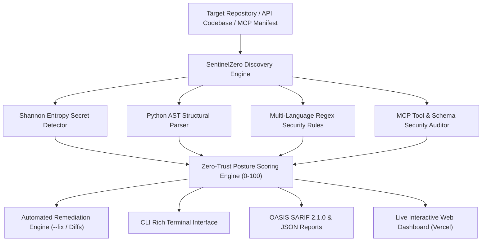

# ⚡ SentinelZero: Autonomous Zero-Trust API & MCP Security Auditor

> **Autonomous defensive cybersecurity intelligence for modern cloud APIs, Model Context Protocol (MCP) servers, and AI agent tool ecosystems.**

[](LICENSE)
[](https://python.org)
[]()
[]()
[](https://web-theta-tawny-78.vercel.app)

---

## 🌐 Live Demonstration & Links
* **Live Interactive Web Dashboard**: [https://web-theta-tawny-78.vercel.app](https://web-theta-tawny-78.vercel.app)
* **GitHub Repository**: [https://github.com/Naveen57990/SentinelZero](https://github.com/Naveen57990/SentinelZero)
* **Target Competition**: **TLN Cybersecurity Hackathon 2026** on Devpost

---

## 🚨 1. The Problem
With the massive surge in AI agents, LLM tool calling, and MCP (Model Context Protocol) server adoptions, developers are connecting autonomous agents directly to internal systems and terminal shells with unverified permissions. Traditional static application security testing (SAST) tools (like SonarQube or Bandit) are completely blind to modern attack surfaces:
* **Unconfined MCP Tool Shells**: Agents equipped with `run_terminal_command` or `shell=True` subprocesses can be hijacked via prompt injection to execute arbitrary host commands.
* **Leaked High-Entropy API Secrets**: Exposed production API keys (AWS, OpenAI, GitHub, Stripe) hardcoded in repository files.
* **Missing Enterprise SSO / Auth Boundaries**: Administrative endpoints left unshielded by OIDC/SAML enterprise single-sign-on guards.
* **Permissive CORS & Insecure Cookies**: Wildcard CORS origins (`*`) and cookies missing `HttpOnly` flags exposing session hijacking vectors.

---

## 🛡️ 2. The Solution: SentinelZero
**SentinelZero** is an autonomous, developer-first cybersecurity auditor built from the ground up for modern APIs and AI agent infrastructure. It performs deterministic, sub-2ms multi-vector analysis:
1. **Shannon Entropy & Regex Secret Engine**: Identifies leaked high-entropy credentials, private keys, and API tokens.
2. **Model Context Protocol (MCP) Security Auditor**: Inspects agent tool manifests, schemas, and handlers for command injection, path traversal, and wildcard parameters.
3. **OWASP API Top 10 & Zero-Trust Linter**: Validates JWT cryptographic verification, CORS access lists, enterprise SSO guards, and SQL query parameterization.
4. **Automated Zero-Trust Remediation Generator**: Generates drop-in unified diffs and can automatically patch insecure code with `--fix`.
5. **Dual Interface**: A rich terminal CLI for local development and CI/CD pipelines (exporting OASIS SARIF 2.1.0), and an interactive dark-mode web dashboard.

---

## 🏛️ 3. Architecture Overview



---

## 🚀 4. Key Features

* **⚡ Ultra-Low Latency**: Scans multi-file codebases in **<2 milliseconds** with zero cloud bloat or heavy dependencies.
* **🤖 First-Class MCP Security**: Special-purpose rules for Model Context Protocol schemas to prevent prompt injection privilege escalation.
* **🛡️ Enterprise SSO Alignment**: Directly audits endpoints for OIDC, SAML, and SSOJet enterprise access protection.
* **🛠️ 1-Click Automated Patching**: Automatically replaces raw credentials with `os.getenv` and tightens insecure configuration flags.
* **📊 Quantitative Posture Score**: Computes a transparent CVSS-weighted zero-trust score (0–100) and letter grade (A through F).
* **🔄 CI/CD Native**: Seamless integration with GitHub Actions via OASIS SARIF 2.1.0 export.

---

## ⚙️ 5. Installation & Quickstart

### Prerequisites
* Python 3.10+
* Git

### Setup
```bash
git clone https://github.com/Naveen57990/SentinelZero.git
cd SentinelZero
python3 -m venv .venv
source .venv/bin/activate
pip install -e .
```

---

## 💻 6. Usage

### Scan a Repository or Directory
```bash
sentinelzero scan ./my-project
```

### Audit an MCP Tool Manifest
```bash
sentinelzero audit-mcp ./mcp_tools.json
```

### Generate SARIF Report for GitHub Security
```bash
sentinelzero scan ./my-project --sarif report.sarif
```

### Automatically Apply Security Fixes
```bash
sentinelzero scan ./my-project --fix
```

---

## 🧪 7. Automated Test Suite

SentinelZero is backed by automated pytest suites running against seeded benchmark vulnerabilities:
```bash
pytest -v
```
**Results**:
* `test_shannon_entropy_calculation`: **PASSED**
* `test_secret_detection_patterns`: **PASSED**
* `test_mcp_unrestricted_shell_detection`: **PASSED**
* `test_mcp_path_traversal_detection`: **PASSED**
* `test_scan_vulnerable_repository`: **PASSED** (10/10 seeded flaws caught, Grade F)
* `test_scan_secure_repository`: **PASSED** (0 false positives, Grade A)

---

## 📋 8. Rule Catalog

| Rule ID | Title | Category | Default CVSS |
| :--- | :--- | :--- | :--- |
| **SZ-001** | Exposed Secret / API Token | Credential & Secret Exposure | **9.0 - 9.8 (CRITICAL)** |
| **SZ-003** | Overly Permissive CORS Origin (`*`) | Security Misconfiguration | **7.5 (HIGH)** |
| **SZ-004** | Insecure JWT Verification (`verify=False`) | Broken Authentication | **9.8 (CRITICAL)** |
| **SZ-005** | Missing Enterprise SSO / Auth Guard | Broken Authentication | **8.5 (HIGH)** |
| **SZ-006** | Cookie Missing `HttpOnly` / `Secure` | Insecure Communication | **5.3 (MEDIUM)** |
| **SZ-007** | SQL Injection via String Formatting | Injection | **8.6 (HIGH)** |
| **SZ-008** | Insecure Deserialization (`pickle.loads`) | Injection | **9.8 (CRITICAL)** |
| **SZ-009** | Database URI with Embedded Password | Credential & Secret Exposure | **9.4 (CRITICAL)** |
| **SZ-010** | Hardcoded `DEBUG=True` in Production | Security Misconfiguration | **6.0 (MEDIUM)** |
| **SZ-MCP-001** | Unrestricted Shell Execution in MCP Tool | Excessive Permissions | **9.6 (CRITICAL)** |
| **SZ-MCP-002** | Unconfined Filesystem Access in MCP Tool | Excessive Permissions | **8.2 (HIGH)** |
| **SZ-MCP-003** | Untyped Parameter in MCP Tool Schema | Security Misconfiguration | **5.5 (MEDIUM)** |

---

## 🎯 9. TLN Hackathon Compliance

* **Theme**: Cybersecurity, Online Safety, Privacy, and Digital Infrastructure.
* **Responsible Research**: 100% defensive static analysis tool. Contains zero attack payloads or exploitation capabilities.
* **AI Disclosure**: Transparently documented in `submission/AI_DISCLOSURE.md`.

---

## 📄 License
MIT License. Created by **Naveen57990** for the TLN Cybersecurity Hackathon 2026.
